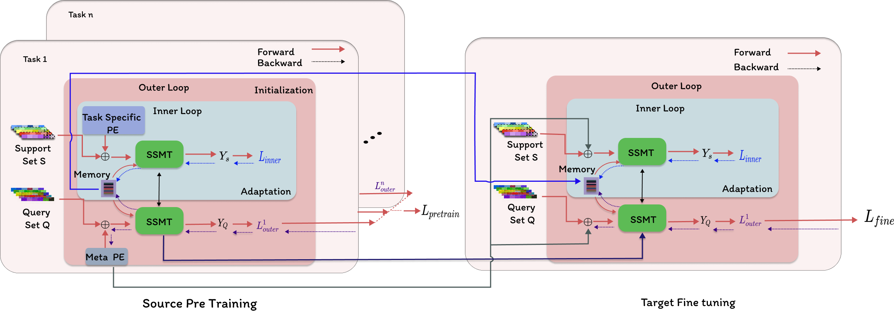

# SSMT: Few-Shot Traffic Forecasting with Single Source Meta-Transfer Learning



This is the official implementation of SSMT: Few-Shot Traffic Forecasting with Single Source Meta-Transfer Learning\
Kishor Kumar Bhaumik, Minha Kim, Fahim Faisal Niloy and Simon S. Woo


## Data Preparation
Download the dataset from here, [Google Drive](https://drive.google.com/file/d/16xbiRvh5jJx2A4Swv9dEMEz_Y0AEoQTM/view)

## MTransL 
Run 
```
python new_model_1.py
```
